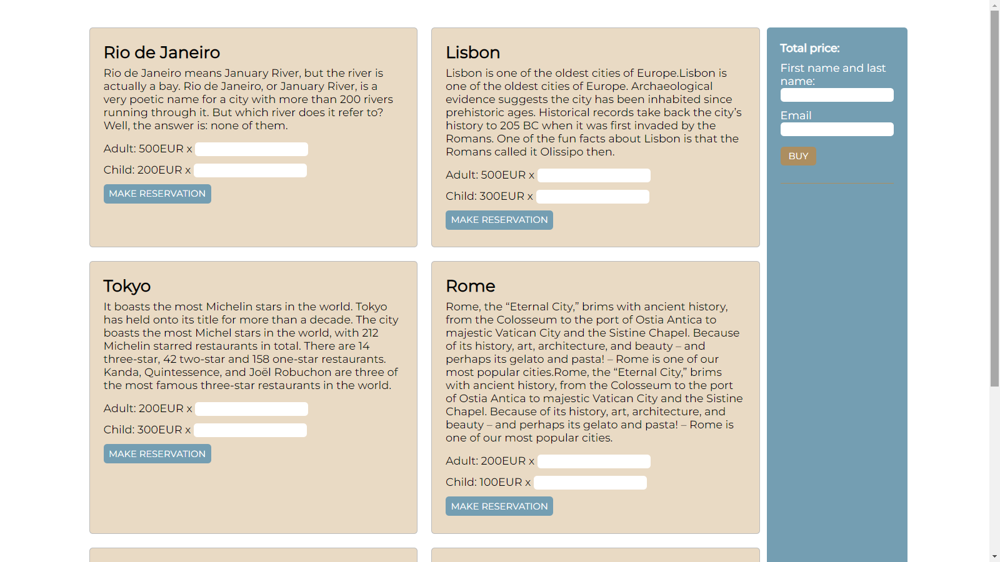

# JavaScript: API and FETCH

## Travel Agency - Description

The aplication is divided into two sections: the Customer section, where you can order tours, and the admin section, which allows you to add a new tour, edit or delete an existing tour.

### Customer section

This is the part related to what the user can do:

* select a trip by entering the number of tickets to be ordered in the appropriate form fields and clicking `make reservation`. It's connected with:
  * data validation
  * adding the order to the panel on the right, to the basket
  * updating the price for the whole
* confirm the order by entering your name, surname and email address in the order field and clicking `buy`. It's connected with:
  * data validation
  * sending the order to the database (in our case it will be an API launched thanks to JSON Server)
  * clearing the basket.



### Admin section

Panel for managing trips saved in the database. Its functionalities are:

* adding trips
* deleting trips
* modifying trips.


## Installation

```
npm install
```
```
npm start
```

### Customer section

```
http://localhost:8080/index.html
```

### Admin section

```
http://localhost:8080/admin.html
```

### JSON Server

In the new terminal:
```
npm install json-server -g
```
```
json-server --watch ./data/excursions.json
```

### API

```
http://localhost:3000
```

Resources:

* <http://localhost:3000/excursions> – excursions management
* <http://localhost:3000/orders> – order management

## Technologies


